<!-- ============================================================ -->
<!--   EDUARDO SPINELLI  //  EVA-03 PILOT  //  CLASSIFIED        -->
<!-- ============================================================ -->


<div align="center">


<br><br>

```
███╗   ██╗███████╗██████╗ ██╗   ██╗
████╗  ██║██╔════╝██╔══██╗██║   ██║
██╔██╗ ██║█████╗  ██████╔╝██║   ██║
██║╚██╗██║██╔══╝  ██╔══██╗╚██╗ ██╔╝
██║ ╚████║███████╗██║  ██║ ╚████╔╝
╚═╝  ╚═══╝╚══════╝╚═╝  ╚═╝  ╚═══╝
```

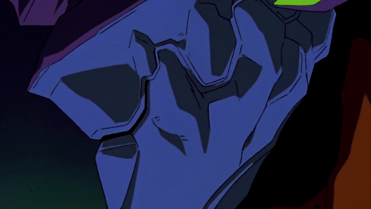

**`CLASSIFIED // EVA-03 PILOT FILE // CLEARANCE: ALPHA`**

[](https://git.io/typing-svg)


<br>

[](#)
[](#)
[](#)
[](#)

<br><br>


</div>

---

### `> NERV TACTICAL CONSOLE`

<div align="center">


<br><br>


</div>

---

## `[ EVA UNITS DEPLOYED ]`

<div align="center">


</div>

> *Active assignments. Sync ratio reflects current operational depth.*

### `EVA-01 // PENTAGRO` &nbsp;·&nbsp; `SYNC ████████░░ 92.4%`

**`Analista de Desenvolvimento Full Stack Júnior`** &nbsp;·&nbsp; `08/2025 — Present`

- Liderança técnica na migração de monolito → microsserviços com **.NET 10**, **Minimal API**, **MediatR**, **Carter** e **Vertical Slice Architecture**
- Mensageria com **RabbitMQ** + observabilidade distribuída com **.NET Aspire**
- Mecanismo de otimização industrial em tempo real (algoritmo **Levenberg-Marquardt**) → **+3% de eficiência** em 3 usinas brasileiras
- Dashboards em tempo real com **Next.js + Chart.js** consumindo dados diretamente de CLPs
- Plataforma de gestão de férias com IA + **n8n** para 45 funcionários
- Pipelines CI/CD individualizadas por microsserviço

### `EVA-02 // SPINSOFTWARE` &nbsp;·&nbsp; `SYNC ████████░░ 86.1%`

**`Fundador & Engenheiro de Software`** &nbsp;·&nbsp; `2025 — Present`

- Plataforma jurídica de acompanhamento processual — **Next.js / NestJS**
- CMS institucional do Sindicato dos Metalúrgicos de São Carlos — **Next.js / Strapi**
- Sistema de busca por similaridade em **15.000+ PDFs** — **Python / RAG** (cliente metalúrgico internacional)
- Plataforma de laudos médicos com IA — **Next.js / Flask / n8n**

### `EVA-03 // UFSCAR IC` &nbsp;·&nbsp; `SYNC ███████░░░ 74.8%`

**`Pesquisador de Iniciação Científica`** &nbsp;·&nbsp; `08/2025 — Present`

- Well-being AI: infraestrutura distribuída para saúde mental com sensores IoT
- Fusão multimodal: **EEG · ECG · GSR · FACS** com criptografia ponta a ponta
- Classificadores **Naive Bayes / SVM** + microsserviços de baixa latência (`< 800ms`)
- **Human-in-the-Loop (HITL)** e **Explainable AI (XAI)** aplicados

---

<details>
<summary><code>[ ARCHIVED UNITS ]</code> &nbsp;— expand to view prior assignments</summary>

<br>

| Period | Unit | Role |
|---|---|---|
| `04/2024 — 05/2025` | **QuestIO** — UFSCar Extension | Backend Dev · Django/DRF + Auth0/JWT |
| `07/2019 — 02/2020` | **SENAI São Paulo** | PLC Programmer · 🥇 1st place WorldSkills SP 2019 |
| `03/2020 — 05/2020` | **Automativa** | Industrial Automation · TIA PORTAL |
| `01/2018 — 01/2020` | **Tecumseh Products Co.** | Jovem Aprendiz · Eletroeletrônica (SENAI 800h) |

</details>

---

## `[ ANGEL ENCOUNTERS ]`

<div align="center">


</div>

> *Production-grade systems shipped. Each angel matched to a project by shape and impact.*

#### `> DEPLOYMENT SEQUENCE // BATTLE LOG`

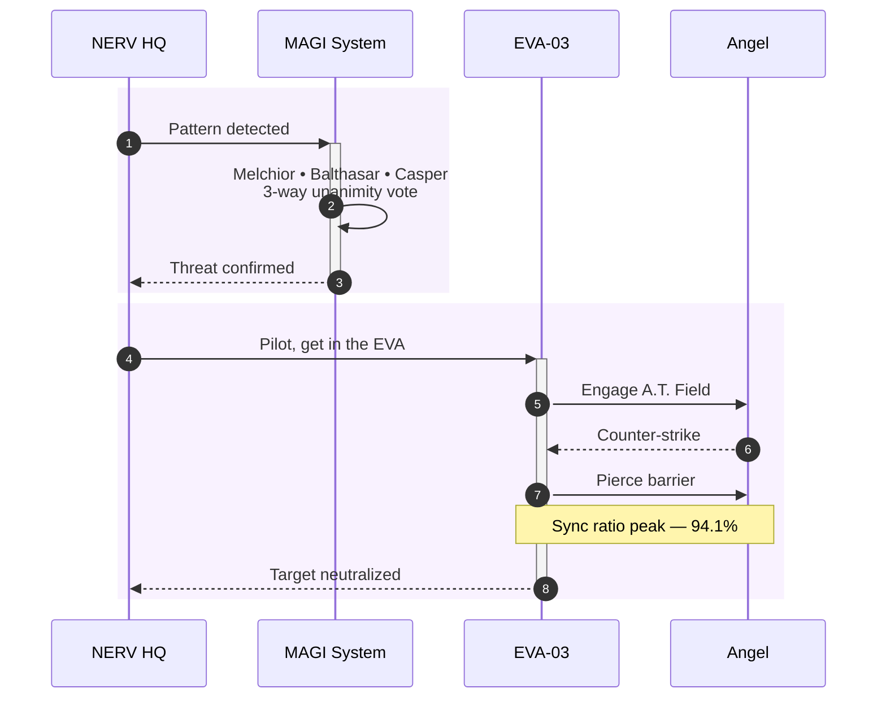


### 🟣 &nbsp;`SACHIEL` &nbsp;·&nbsp; *Levenberg-Marquardt Optimizer*
First contact. Engine de otimização industrial em tempo real em **.NET** calculando cenários ótimos de operação para usinas de cana-de-açúcar. Resultado: **+3% de eficiência em 3 usinas brasileiras**.

### 🟣 &nbsp;`RAMIEL` &nbsp;·&nbsp; *TRACTIAN Hackathon — 🥈 2nd Place*
Precision strike. Plataforma onde líderes industriais enviam áudio via WhatsApp → o sistema gera ordens de serviço com passo-a-passo automaticamente. Stack: **Whisper + RAG + tokenização + geração automática de PDFs**.

### 🟣 &nbsp;`ISRAFEL` &nbsp;·&nbsp; *PDF Similarity Search*
Split nature. Engine de busca por similaridade em **15.000+ documentos PDF** para indústria metalúrgica internacional via **Python + RAG** sobre embeddings.

### 🟣 &nbsp;`SAHAQUIEL` &nbsp;·&nbsp; *AI Vacation Platform*
The watcher. Plataforma automatizada de gestão de férias processando e-mails de coordenadores via **n8n** com parsing automático e agendamento inteligente para **45 funcionários**.

### 🟣 &nbsp;`LELIEL` &nbsp;·&nbsp; *Well-being AI*
The shadow. Pesquisa em saúde mental fundindo sinais biométricos multimodais (EEG, ECG, GSR, FACS) com classificadores ML e microsserviços de baixa latência. UFSCar.

### 🟣 &nbsp;`BARDIEL` &nbsp;·&nbsp; *Medical Reports AI*
Plataforma de laudos médicos com inteligência artificial — **Next.js + Flask + n8n** — foco em workflow clínico automatizado.

### 🟣 &nbsp;`SHAMSHEL` &nbsp;·&nbsp; *Industrial Automation Legacy*
Whip arms — sistemas de controle. Programação de **CLPs** e código em **TIA PORTAL** para automação industrial regional + revisão de conectores da Volkswagen do Brasil. Where it all began.

### 🟣 &nbsp;`MATARAEL` &nbsp;·&nbsp; *QuestIO — UFSCar Extension*
The persistent rain. Plataforma de laboratórios remotos do Departamento de Computação da UFSCar — **Django + DRF** com **Auth0/JWT**, cultura de testes automatizados, refactor de queries e onboarding docs com OpenAPI.

### 🟣 &nbsp;`ZERUEL` &nbsp;·&nbsp; *Monolith-to-Microservices Migration*
The strongest angel. Liderança técnica da migração do sistema da **Pentagro** de monolito distribuído para microsserviços com **.NET 10**, **Minimal API**, **MediatR**, **Carter**, **Vertical Slice Architecture** e **RabbitMQ** + observabilidade com **.NET Aspire**.

### 🟣 &nbsp;`ARMISAEL` &nbsp;·&nbsp; *Twilio Comms Integration*
The DNA helix — fusão de canais. Integração de **Twilio API** para SMS e WhatsApp Business + **autenticação JWT** com Identity Framework no backend .NET Core.

### 🟣 &nbsp;`ARAEL` &nbsp;·&nbsp; *Sindicato Metalúrgicos CMS*
The light — knowledge surface. Plataforma de gestão de conteúdo para o site institucional do Sindicato dos Metalúrgicos de São Carlos com **Next.js + Strapi CMS**.

### 🟣 &nbsp;`SANDALPHON` &nbsp;·&nbsp; *Plataforma Jurídica*
The volcanic — pressure-tested. Plataforma jurídica de acompanhamento processual com **Next.js / React** no frontend e **NestJS / Node.js** no backend.

### 🟣 &nbsp;`TABRIS` &nbsp;·&nbsp; *Real-time CLP Dashboards*
The final angel. Dashboards de visualização em tempo real com **Next.js + Chart.js** consumindo dados diretamente de **CLPs das usinas** para análise pela equipe de engenharia.

---

## `[ SIDE OPERATIONS // INTEL BRIEFING ]`

> *Public repositories — declassified field reports.*

| ID | Codename | Stack | Brief |
|:---:|:---|:---:|:---|
| `OP-019` | [**Encurtador**](https://github.com/Edu-Spinelli/Encurtador) |  | URL shortener engine |
| `OP-018` | [**auth**](https://github.com/Edu-Spinelli/auth) |  | JWT auth module |
| `OP-017` | [**estudo-nest**](https://github.com/Edu-Spinelli/estudo-nest) |  | NestJS deep-dive |
| `OP-016` | [**hackathon-magalu**](https://github.com/Edu-Spinelli/hackathon-magalu) |  | Magalu hackathon entry |
| `OP-015` | [**T2-DevOps-Plannerrun**](https://github.com/Edu-Spinelli/T2-DevOps-Plannerrun) |  | DevOps planning tool |
| `OP-014` | [**pipes-and-filters**](https://github.com/Edu-Spinelli/pipes-and-filters) |  | Architecture pattern study |
| `OP-013` | [**CoinLearning**](https://github.com/Edu-Spinelli/CoinLearning) |  | Crypto ML experiments |
| `OP-012` | [**UAU_django-vue**](https://github.com/Edu-Spinelli/UAU_django-vue) |  | Django + Vue integration |
| `OP-011` | [**front-odonto**](https://github.com/Edu-Spinelli/front-odonto) |  | Dental clinic frontend |
| `OP-010` | [**uau_node_react**](https://github.com/Edu-Spinelli/uau_node_react) |  | Node + React integration |

---

## `[ NERV CHRONOLOGY // CAREER TIMELINE ]`

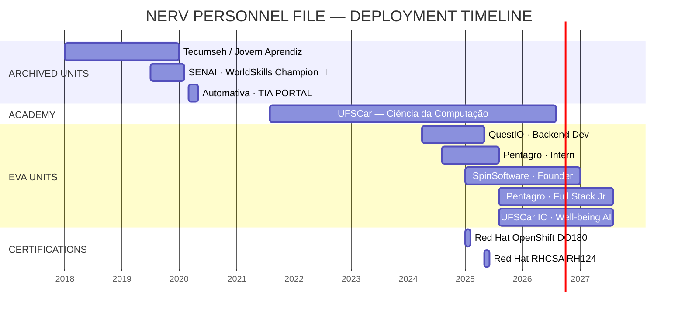

---

## `[ A.T. FIELD ACTIVE ]`

<div align="center">

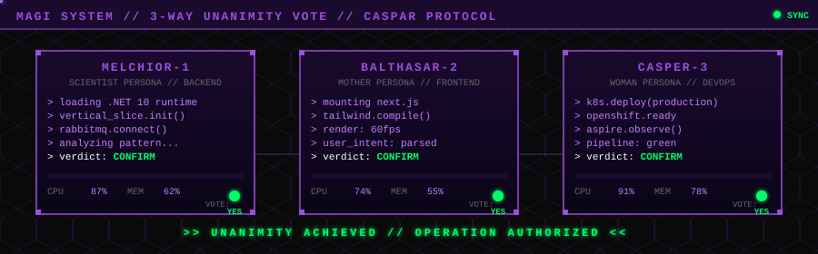

<br><br>


</div>

> *MAGI System distributed cognition. Three nodes — one stack.*

### `▸ MELCHIOR-1` &nbsp;//&nbsp; Backend & Core
[](https://skillicons.dev)

`.NET 6/7/8/10` · `Minimal API` · `MediatR` · `Carter` · `Vertical Slice` · `Clean Architecture` · `SOLID`

### `▸ BALTHASAR-2` &nbsp;//&nbsp; Frontend & Interface
[](https://skillicons.dev)

`Vue 3 / Pinia` · `Next.js 14+` · `Chart.js` · `TailwindCSS`

### `▸ CASPER-3` &nbsp;//&nbsp; DevOps, Infra & Cloud
[](https://skillicons.dev)

`OpenShift` · `.NET Aspire` · `RHEL` · `Zabbix` · `GitFlow` · `CI/CD`

### `▸ DATA NEXUS`
[](https://skillicons.dev)

`SQL Server` · `Entity Framework Core`

### `▸ AI / ML SUBSYSTEMS`
`RAG (Retrieval-Augmented Generation)` · `Whisper` · `Scikit-learn` · `Naive Bayes` · `SVM` · `LLM Integration` · `n8n`

### `▸ MESSAGING & PROTOCOLS`
`RabbitMQ` · `REST` · `GraphQL` · `WebSockets` · `OAuth2 / JWT` · `Twilio (SMS/WhatsApp)`

---

## `[ MAGI SYSTEM // COMBAT RECORDS ]`

<div align="center">


<br><br>


<br><br>


<br><br>


</div>

---

## `[ ANGEL INTERCEPT GRID ]`

<div align="center">


*Sachiel approaches Tokyo-3. EVA-03 intercepts.*

</div>

---

## `[ DECORATIONS ]`

|     |     |
|:---:|:---|
| 🥇 | **1st Place** — São Paulo Skills 2019 · *PLC Programming / Mechatronics* |
| 🥈 | **2nd Place** — Hackathon TRACTIAN 2024 |
| 🎖️ | **Red Hat Certified System Administrator (RHCSA)** — RH124 v9.3 · 2025 |
| 🎖️ | **Red Hat OpenShift Administration I (DO180)** — 2025 |

<div align="center">

[](#)
[](#)
[](#)
[](#)

</div>

---

## `[ TRANSMISSION CHANNELS ]`

<div align="left">

[](https://www.linkedin.com/in/eduardo-spinelli-a309011a1/)
[](mailto:eduardospinelli11@gmail.com)
[](https://github.com/Edu-Spinelli)
[](https://www.instagram.com/edu_spinelli/)
[](https://www.pentagro.com.br/)

</div>

---

<div align="center">


</div>

---

<div align="center">

```
> The fate of destruction is also the joy of rebirth.
```

</div>

<br>

<details>
<summary><code>[ CLASSIFIED // SCENARIO 14 // BERSERKER MODE — DO NOT OPEN ]</code></summary>

<br>

> *Pilot uplink severed. EVA-01 acting on its own. Sync ratio reading: 400%. Off the scale.*

```
[ STATUS ]
  UMBILICAL ........ DISCONNECTED
  POWER SOURCE ..... S2 ENGINE
  OPERATIONAL TIME . UNLIMITED
  CONTROL .......... AUTONOMOUS
```

#### `> HIDDEN STACK // EXPERIMENTAL`
`Rust` · `Elixir` · `LangChain` · `LlamaIndex` · `Terraform` · `Tauri` · `Bun` · `Deno`

#### `> READING LIST // CURRENT`
- **Designing Data-Intensive Applications** — Kleppmann
- **Building Microservices** — Newman
- **Domain-Driven Design** — Evans
- **Site Reliability Engineering** — Google

#### `> CURRENT OBSESSIONS`
- Distributed systems that don't blow up under load
- AI agents que de fato fazem trabalho útil (não só demos)
- Production observability stories — traces, metrics, logs, alertas que importam
- Edge-deployed AI / on-device inference

#### `> SECRET TRANSMISSION`
Se você chegou até aqui no README, manda um `oi` no [LinkedIn](https://www.linkedin.com/in/eduardo-spinelli-a309011a1/) com o código `SACHIEL_NEUTRALIZED`. Eu respondo.

> *"It moved on its own..."* — Misato Katsuragi

</details>


